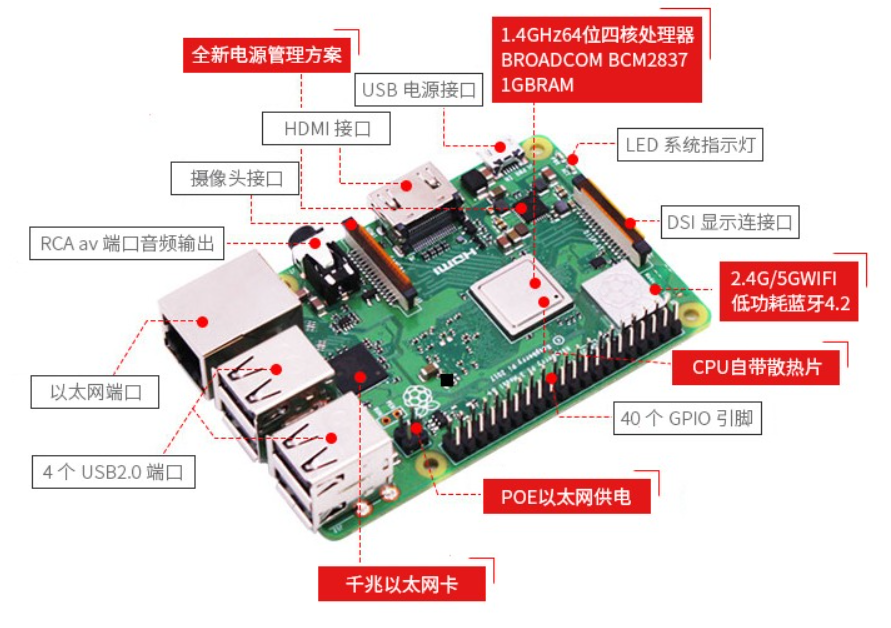
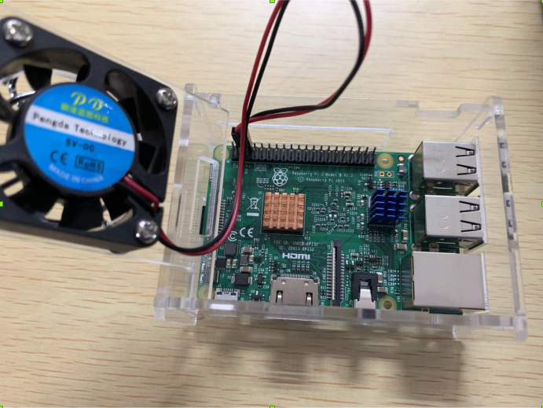

## 第一章 开发环境

### 开发（硬件）环境
1. 主机端  
一台或多台装有Linux操作系统的PC，可装在虚拟机内或双系统；
2. 目标端  
以树莓派开发板为核心，配以辅助硬件，如传感器、显示屏等。  

开发板详细参数：  
处理器：博通BCM2837B0 SoC，四核ARM Cortex-A53（ARMv8）64位@ 1.4GHz CPU  
GPU：博通 Videocore-IV GPU  
内存：1GB LPDDR2 SDRAM  
有线网络：千兆以太网（通过USB2.0通道，最大吞吐量 300Mbps）  
无线网络：2.4GHz和5GHz 双频Wi-Fi，支持802.11b/g/n/ac  
蓝牙：蓝牙4.2&低功耗蓝牙（BLE）  
存储：Micro-SD  
其他接口：HDMI，3.5mm模拟音频视频插孔，4x USB 2.0，以太网，摄像机串行接口（CSI），显示器串行接口（DSI），MicroSD卡座，40pin扩展双排插针  
尺寸：82mmx 56mmx 19.5mm，50克  

### 运行（软件）环境
1. Raspbain Jessie With PIXEL  
树莓派官方系统，基于Debain Jessie，带PIXEL图形界面。特点是兼容性和性能优秀。
2. Raspbain Jessie Lite  
树莓派官方系统，基于Debain Jessie，不带图形界面。特点是兼容性和性能优秀，比PIXEL版本的安装包更小。
3. Ubuntu MATE  
Ubuntu MATE 针对树莓派的版本，界面个性美观。
4. Snappy Ubuntu Core  
Ubuntu 针对物联网（IoT）的一个发行版本。支持树莓派。
5. CentOS  
CentOS 针对ARM的发行版。支持树莓派。
6. Windows IoT  
微软官方针对物联网（IoT）的一个Windows版本。支持树莓派。
7. FreeBSD  
FreeBSD 针对树莓派的发行版。
8. Kali  
Kali 针对树莓派的发行版，黑客的最爱。
9. Pidora  
在 Fedora Remix 基础上针对树莓派优化过的操作系统。
10. ArchLinux  
ArchLinux 针对树莓派平台的版本。  

我们小组选用Raspbain系统，该系统是官方系统，且开源资源最多，便于查阅资料和解决问题。

### 编程环境
编译器：gcc，g++；  
调试器：gdb；  
解释器：python 2&3；  

编程语言：C/C++，Python；  
