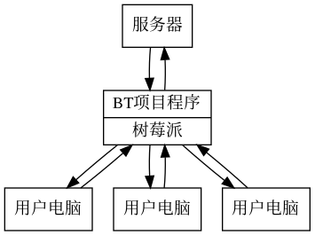

## 第二章 需求分析

### 项目名称
BT云助手

### 项目架构

在树莓派上安装编写程序，采用BT协议从服务器获取资源，再分配给用户。

### 功能需求

BT(BitTorrent)是一种通讯协议，用于在互联网上实现P2P文件共享。我们在用传统方式下载文件时，文件数据都来自于相应服务器，如果下载的人很多会给服务器造成压力导致下载速度变慢。BitTorrent协议利用了用户资源来减轻服务器压力，用户在其中不单纯从网络上下载资源，还同时将自己所获得的资源分享给其他用户。这样一来服务器不需要对每个用户提供完整的文件资源，只需要将文件分成几个部分分发给用户，再由用户之间互相共享，就能使用户获得全部文件。采用BitTorrent协议不但可以减轻服务器压力，还可以提高用户的下载速度，下载同样文件的用户越多，下载速度反而越快。

现在我们想在树莓派上做一个关于BitTorrent的项目，树莓派可以作为一个数据中心，预先从服务器上下载一些我们可能需要的资源，我们需要使用这些资源的时候就会方便许多。

### 项目所需的软硬件条件

- 硬件  
	树莓派3B  
	网线  
	用户电脑等其他设备  

- 软件  
	根据查找的资料，常见的BT客户端软件有μTorrent, 迅雷,Transmission, qBittorrent, Vuze, Deluge, BitComet等。网上关于树莓派的这方面资料比较多的是Transmission和Deluge，可能因为它们都是开源软件，对学生和开发者比较友好。也有用Xware实现迅雷下载的资料，但是现在迅雷已经停止支持第三方软件下载了。Transmission和Deluge都是跨平台带有GUI的，Windows和Linux下都能使用。它们作为BT客户端支持加密协议、DHT、PEX等，轻量级且功能强大，适于嵌入式开发。