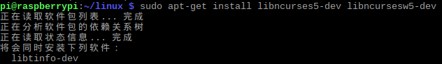
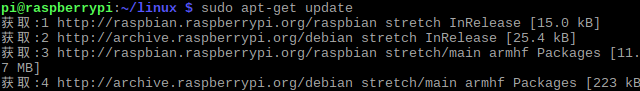

## 第三章 构建目标系统
### 1 用默认配置编译一遍内核，将新的内核替换现有内核
#### 树莓派本地编译
 （1）获取源码
下载地址：https://github.com/raspberrypi  
·git clone --depth=1 https://github.com/raspberrypi/linux ·  
   
树莓派所有的开源软件：  
- linux:内核源码
- tools:编译内核和其他源码所需的工具——交叉编译器等
- firmware:树莓派的交叉编译好的二进制内核、模块、库、bootloader
- documentation:树莓派离线帮助文档（树莓派官方使用教程）
- userland：arm端用户空间的一些应用库的源码
- hats：Hardware Attached on Top，树莓派 B+型板子的扩展板资料
- maynard：一个gtk写成的桌面环境
- scratch：一个简易、可视化编程环境
- noobs:一个树莓派镜像管理工具，他可以让你在一个树莓派上部署多个镜像
- weston：一个应用程序
- target_fs：树莓派最小文件系统，使用busybox制作
- quake3：雷神之锤3有线开发源码firmwareb  
（2）配置编译环境  
树莓派本地编译：交叉工具链，本身的编译工具就可以编译给自己使用，所以不用配置，只需要配置 KERNEL=kernel7 即可。  
可以用 export KERNEL=kernel7，一次设置之后此终端里所有命令都带有此环境变量。  
（3）配置config  
树莓派1使用的是 bcmrpi_defconfig，  
树莓派2、3使用的是 bcm2709_defconfig。  
KERNEL=kernel7 make bcm2709_defconfig  
如果要使用树莓派自带的config的话：  
sudo modprobe configs # 加载模块  
zcat config.gz > .config # 获取配置  
问题1：  
bison: not found  
   
sudo apt-get bison  
   
问题2：  
flex: not found    
   
sudo apt-get install flex    
   
完成  
   
（4）编译  
安装必要的库：  
sudo apt-get install bc  
   
sudo apt-get install libncurses5-dev libncursesw5-dev  
   
sudo apt-get install zlib1g  
   
sudo apt-get install libc6  
   
1）执行menuconfig  
KERNEL=kernel7 make menuconfig  
   
   
2）编译  
KERNEL=kernel7 make -j4 zImage modules dtbs  
   
编译完成  
   
问题：  
fatal error: openssl/bio.h: 没有那个文件或目录  
   
sudo apt install libssl-dev  
   
3）打包zImage文件  
直接用linux源码包里的工具：  
./scripts/mkknlimg arch/arm/boot/zImage ./kernel_new.img  
   
   
在本目录生成一个kernel_new.img文件，这个文件就是要放到sd卡中的文件。  
（4）更新系统  
1）安装模块  
sudo make modules_install  
   
2）复制dtb文件  
sudo cp arch/arm/boot/dts/*.dtb /boot/   
sudo cp arch/arm/boot/dts/overlays/*.dtb* /boot/overlays/   
sudo cp arch/arm/boot/dts/overlays/README /boot/overlays/  
   
3）更新kernel.img文件  
KERNEL=kernel7  
sudo cp arch/arm/boot/zImage /boot/$KERNEL.img  
    
更新之前的内核版本  
    
更新之后的内核版本  
    
#### 主机编译  
1 获取交叉编译工具和源码  
源码：git clone git@github.com:raspberrypi/linux  
交叉编译工具：git clone git@github.com:raspberrypi/tools  
    
    
2 编译  
安装必要的库：  
sudo apt-get install bc  
    
sudo apt-get install libncurses5-dev libncursesw5-dev  
    
sudo apt-get install zlib1g:i386  
    
sudo apt-get install libc6-i386 lib32stdc++6 lib32gcc1 lib32ncurses5  
（1）执行menuconfig  
ARCH=arm CROSS_COMPILE=arm-linux-gnueabihf- KERNEL=kernel7 make menuconfig  
    
    
对裁剪进行裁剪，见上  
（2）编译  
ARCH=arm CROSS_COMPILE=arm-linux-gnueabihf- KERNEL=kernel7 make -j4 zImage modules dtbs 2>&1 | tee build.log  
     
编译完成  
     
（3）打包zImage文件  
直接用linux源码包里的工具：  
./scripts/mkknlimg ./arch/arm/boot/zImage ./kernel_new.img  
     
      
3 挂载树莓派sd卡  
把树莓派的sd卡插入ubuntu系统电脑，树莓派的sd卡有两个分区：  
一个fat分区，是boot相关的内容，kernel的img文件就放在这个分区里；  
一个是ext4分区，也就是系统的根目录分区。   
我们生成的文件涉及到这两个分区的内容，一般插入ubuntu后会自动挂载，fat分区可以不用root权限操作，ext4分区需要root权限操作。两个分区具体挂载在什么地方可以自己决定  
（1）安装modules  
插入SD卡，使用 lsblk 看一下，可以看到新增如下输出  
     
挂载SD卡  
mkdir mnt  
mkdir mnt/fat32  
mkdir mnt/ext4  
sudo mount /dev/sdc1 /mnt/fat32  
sudo mount /dev/sdc2 /mnt/ext4  
     
     
sudo make ARCH=arm CROSS_COMPILE=arm-linux-gnueabihf-INSTALL_MOD_PATH=/mnt/ext4 modules_install  
操作ext4分区，需要root权限。 
     
      
（2）更新 kernel.img 文件  
备份原先的img文件  
sudo cp /mnt/fat32/$KERNEL.img /mnt/fat32/$KERNEL-backup.img  
      
前面已经用 mkknlimg 工具打包了kernel_new.img文件了，把它复制到boot分区并配置使用即可：  
sudo cp kernel_new.img /mnt/fat32/ $KERNEL.img  
      
编辑 mount/fat32/config.txt 文件，在最后加入一行：  
sudo echo kernel=kernel_new.img >> ./mount/fat32/config.txt  
kernel=kernel_new.img  
（3）复制其他相关文件  
sudo cp arch/arm/boot/dts/*.dtb /mnt/fat32/  
sudo cp arch/arm/boot/dts/overlays/*.dtb* /mnt/fat32/overlays/  
sudo cp arch/arm/boot/dts/overlays/README /mnt/fat32/overlays/  
      
卸载  
sudo umount /mnt/fat32   
sudo umount /mnt/ext4  
      
更新之前的内核版本  
      
更新之后的内核版本  
      
升级内核的另一个方法是将img文件复制到相同目录下，使用不同的文件名，如kernel-myconfig.img，然后修改boot目录下的config.txt文件，加入：kernel=kernel-myconfig.img，最后将SD卡插入树莓派启动系统。  
### 2 构建一个较小的Linux内核，内核版本选择现已安装到开发板的内核版本，比较裁剪前后内核映像文件的大小  
（1）裁剪内核  
（Y=>N）  
1）Mailbox Hardware Support --> BCM2835 Mailbox  
      
BCM2835不使用  
2）Device Drivers --> Dallas's 1-wire support  
      
一线总线不使用  
3）Device Drivers --> Sound card support  
      
不使用声卡  
4）Device Drivers --> Multimedia support--> Cameras/video grabbers support  
    
不使用摄像头  
5）Device Drivers --> Multimedia support-->Analog TV support  
    
不使用模拟电视  
6）Device Drivers --> Multimedia support-->Digital TV support  
    
不使用数字电视  
7）Device Drivers --> Multimedia support-->AM/FM radio receivers/transmitters support  
    
不使用广播  
8）Device Drivers --> Character devices  
    
嵌入式中一般不使用虚拟终端  
9）Device Drivers --> Character devices  
    
老式设备，已经废弃  
10）Device Drivers > Input device support  
    
游戏杆驱动不使用  
11）Device Drivers --> Input device support  
    
触摸屏不使用  
(M=>N)  
1）Device Drivers > Character devices   
  ![59]59(.png)  
基于硬件的“可信赖平台模块”。在一般情况下，建议选择N。  
2）Device Drivers --> Input device support  
    
游戏杆不使用  
（2）编译  
KERNEL=kernel7 make -j4 zImage modules dtbs   
make后将新的内核安装到开发板运行测试；  
编译完成  
      
（3）打包zImage文件  
直接用linux源码包里的工具：  
./scripts/mkknlimg arch/arm/boot/zImage ./kernel_new.img  
     
     
裁剪后的映像文件为4.9M，小于未裁剪时的5.1M  
### 3模块加载与卸载  
（1）安装软件  
sudo apt-get update  
sudo apt-get install raspberrypi-kernel-headers  
     
     
（2）编写hello_kernel.c和Makefile文件  
###### hello_kernel.c  
     
###### Makefile  
     
（3）编译  
make  
     
     
（4）安装模块  
sudo make install  
    
  dmesg查看模块信息  
     
（5）卸载模块  
sudo make uninstall  
     
dmesg查看模块信息  
     
### 4 构建并安装一款文件系统。  
（1）fdisk 可以查看当前的文件系统的使用情况  
     
（2）创建分区  
disk /dev/mmcblk0  
     
具体帮助使用m代号  
     
使用代号p可以查看当前磁盘分区状况  
     
通过n代号新增分区   
磁盘最多只能有四个非逻辑分区，其中扩展分区0-1个，逻辑分区是在扩展分区下创建  
     
     
新增加了/dev/mmcblk0p5  
（3）格式化分区为需要的文件系统  
partprobe  
     
该命令强制让内核重新找一次分区表  
mkfs -t ext3 /dev/mmcblk0p5  
      
（4）挂载文件系统  
mount /dev/mmcblk0p5 /mnt/ext3fs  
      
     
 

